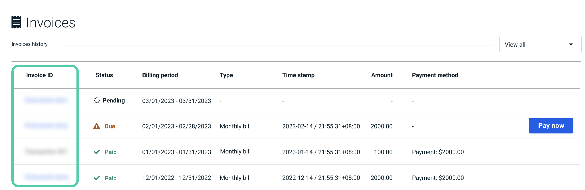

You can view the usage and the corresponding charges for each project during the ongoing billing period. You can also download a PDF version of the invoice for your records.

## Check current spending

To check the details of your spending during the current billing period:

1. Go to [**Billing**](https://cloud.risingwave.com/billing).
2. Click on the [**Current Spending**](https://cloud.risingwave.com/billing/spending/) section.

    

## Check previous spending

To check the details of your spending during previous billing periods:

1. Go to [**Billing**](https://cloud.risingwave.com/billing).
2. Click on the [**Invoices**](https://cloud.risingwave.com/billing/invoices/) section.

    

3. Click on the invoice ID to view the detailed breakdown of the invoice.

    