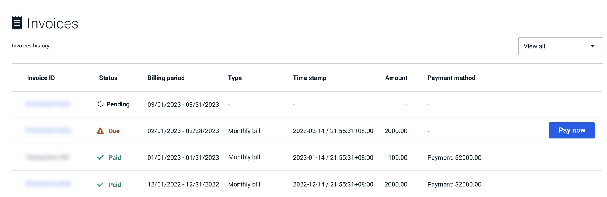

In [**Invoices**](https://cloud.risingwave.com/billing/invoices/), you can access a detailed history of your bills, including invoice IDs, billing periods, invoice status, payment amounts, payment methods, and payment times.

## Review invoices

At the start of each month, you'll receive an invoice that consolidates the usage and associated costs for all your projects from the preceding month.

Your invoices provide a record of your usage and payments. It includes:

- **Invoice ID**: Unique identifiers for each invoice. You can click on the invoice ID to view the detailed breakdown of the invoice. See details in [Check spending details](/billing-check-spending-details.md).
- **Status**: The payment status of each invoice. See [Invoice statuses](#invoice-statuses) below for detailed descriptions.
- **Billing period**: The start and end dates of the billing period.
- **Payment time**: The date and time each payment was made.
- **Payment amount**: The total amount charged for each invoice.
- **Payment method**: The method used to make each payment.

### Invoice status

- **Pending**: Still in active tracking of ongoing service usage throughout the month. You can [check the details of your current spending](/billing-check-spending-details.md#check-current-spending).
- **Open**: Commencement of the payment process once the billing period ends. Automatic payments will be made using your saved [payment methods](/billing-manage-payment-methods.md). This status will last for 10 days.
- **Paid**: Payment has been successfully processed, either automatically or manually.
- **Overdue**: Notification of outstanding payments (10-day grace period) if the automatic payment fails. Please make a payment manually within 10 days.
- **Failed**: If a payment is not successfully fulfilled in the 10-day overdue period. All services that you’re currently using will be stopped.

## Pay invoices automatically

RisingWave Cloud will attempt to charge your saved payment methods after each billing period (when the invoice status is "Open"). Set up your [payment methods](/billing-manage-payment-methods.md) to automate payments.

If one payment method is canceled or rejected, RisingWave Cloud will charge another. RisingWave Cloud will not retry to auto-charge during the "Open" period if all payment methods fail. You can make manual payments during the "Open" and "Overdue" periods.

## Pay invoices manually

The automatic payment process could fail if your payment methods are invalid or declined. In this case, you can settle the outstanding payments manually.

To pay an invoice manually, click the **Pay Now** button on the invoice you want to pay and follow the instructions on the screen.

:::caution
If you don't settle the outstanding payments within 10 days of the "Overdue" period, all services that you’re currently using will be stopped and you won't be able to create any new projects. You have to contact the support team to resume the services.
:::