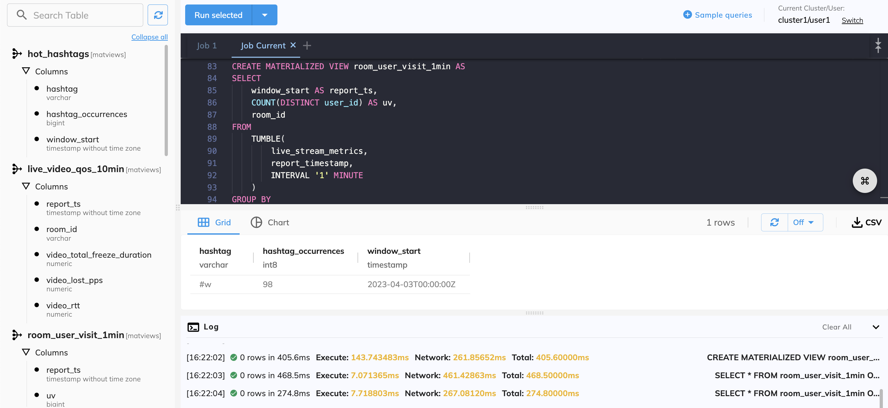

<!-- MDX imports -->
import DefaultButton from "@site/src/components/DefaultButton";
import OutlinedCard from "@site/src/components/OutlinedCard";

It is the most intuitive and easy way to interact with RisingWave via workspace. It offers graphical tools for managing data and visualizing results.

<DefaultButton text="Go to query console" url="https://cloud.risingwave.com/console/" block/>

## Sections

Click on a section below to see the details.

<map name="image-map">
    <area href="#schema" coords="2,2,179,573" shape="rect" />
    <area href="#query-editor" coords="183,2,710,360" shape="rect" />
    <area href="#query-results" coords="183,364,710,573" shape="rect" />
</map>

### Schema

The schema section displays all the tables, sources, materialized views, and sinks defined in the cluster.

To check their columns, click on each item, or click **Expand all** to see all.

### Query editor

The query editor serves as a terminal window where you can write and execute SQL queries.

#### Jobs

Jobs allow you to organize your SQL statements into groups, making managing and executing multiple queries easier.

Click  to add a job.

#### Sample queries

The sample queries cover the most common steps in RisingWave, such as establishing a connection with a data source, processing data by defining materialized views and querying the results.

See [Explore RisingWave with examples](./quickstart.md#step-4-explore-risingwave-with-examples) for details.

#### Switch users

Click **Switch** in the top right corner to change to another user in your current project when using the console.

### Query results

Here you can view the results of your last query.

#### Visualize results

Selete the **Chart** tab to visualize the results.

#### Refresh results

Click  to rerun the last executed query manually or set a timer to refresh the results automatically.

#### Download results

Click  to download a CSV copy of the results.

#### Query log

Selete the **Log** tab to check the query log.

The query log tracks and records all queries executed during the current session, providing information such as the execution time, network time, and error messages. The log can help monitor activity, troubleshoot issues, and optimize queries.

## Start developing

<OutlinedCard
title="Develop with RisingWave Cloud"
content="RisingWave Cloud leverages the superpower of RisingWave, an open-source distributed SQL database specifically designed for stream processing. Start building your real-time applications with RisingWave using the console."
cloud="develop-overview"
/>
