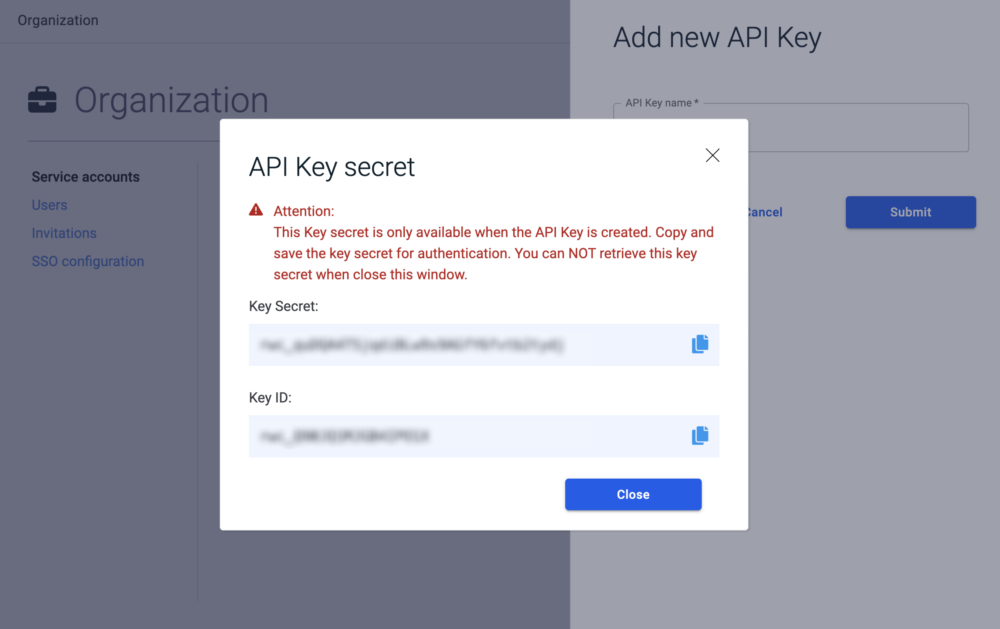

In RisingWave Cloud, a user account typically represents an individual user who interacts with resources via the user interface. On the other hand, a service account represents an application. It accesses RisingWave Cloud resources on the application's behalf, using API keys for authentication.

This article will guide you through the process of setting up a service account for your applications and generating an API key.

## Create a service account

**Steps:**

1. Go to the [**Org.**](https://cloud.risingwave.com/organization/) tab and select **Service accounts**.

2. Click **New service account**.

   

3. Enter a descriptive name for your service account and write a short description.

4. Click **Confirm**.

   

## Generate an API key

You can generate multiple API keys for a service account. Each API key will have a unique key ID and secret.

**Steps:**

1. In the account list, click the name of the service account you want to generate API keys for.

  

1. Select the **API Keys** tab.

  

3. Click **Add new API Key**.

4. Enter a descriptive name for your API key and click **Submit**.

5. A new API key will be generated. Please save the secret along with the ID to a safe place.

  :::caution
  The secret will be shown only once. After you close the dialog, you won't be able to retrieve it. If you lose the secret, you have to generate a new API key.
  :::

  
