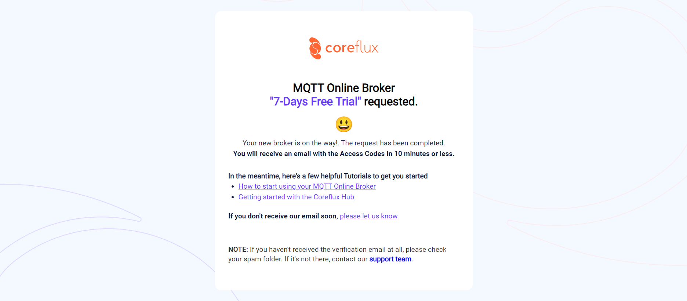
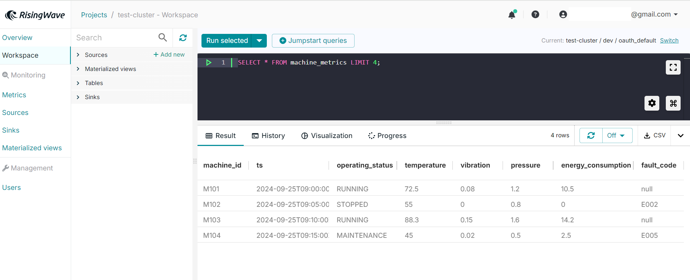

<head>
  <link rel="canonical" href="https://docs.risingwave.com/docs/current/ingest-from-coreflux-broker/" />
</head>

You can ingest data from [Coreflux](https://coreflux.org/). Coreflux is an IoT platform designed for efficient data pipeline management that supports cloud, edge, and on-premise deployments across multiple protocols. Its scalable MQTT broker enables real-time, reliable communication between IoT devices and applications, ideal for low-latency, high-throughput environments, from small IoT projects to large industrial setups.

## Set up the Coreflux Broker

This guide walks you through the steps to set up a Coreflux broker on Coreflux Cloud and connect it to **RisingWave** for data ingestion. For more details about Coreflux, please refer to the [Coreflux documentation](https://docs.coreflux.org/).

### 1. Sign up for a Coreflux Cloud account

Start by signing up for a free Coreflux Cloud account, which includes a 7-day free trial of the Coreflux Online MQTT Broker. To create an account, visit [Coreflux Cloud](https://auth.coreflux.org/createAccount).


*Sign up for a Coreflux Cloud account*

### 2. Create a Coreflux Cloud Broker

After creating your Coreflux account, you can choose from three plans: **FREE TRIAL**, **PLUS PLAN**, and **ENTERPRISE PLAN**. To set up a free MQTT broker, select **FREE TRIAL**.


Select your preferred region from Coreflux's 9 global data centers for optimal performance and data locality.


After selecting a region, click **Start Trial** to launch your Coreflux broker.


After clicking **Start Trial**, you will see a confirmation message indicating that Coreflux has received your request to create a free broker. Access codes will be sent to you via email.



You will receive an email confirming the creation of your Coreflux broker, including the broker address and login credentials.


You can use [MQTT Explorer](http://mqtt-explorer.com/), an intuitive tool for connecting to your MQTT broker. To manage users, such as adding, removing, or changing passwords via MQTT commands, refer to the [Coreflux guide](https://docs.coreflux.org/getting-started/mqtt-explorer-and-coreflux-cloud-broker/).

You are now ready to connect to your Coreflux Cloud broker using various clients. These clients allow you to both publish and subscribe to messages on your MQTT topics. For illustration, we'll use IoT data from a manufacturing scenario, such as monitoring machine performance and detecting faults. Using the Python Paho MQTT client, we will publish this data to the MQTT topic `factory/machine_data`.


## Ingest and process data from the Coreflux Broker

### 1. Create a RisingWave cluster

Create a RisingWave cluster in [RisingWave Cloud](https://cloud.risingwave.com/) using the free plan. For more information, refer to the [RisingWave Cloud documentation](https://docs.risingwave.com/cloud/manage-clusters/).

### 2. Create a source

Once you have deployed the RisingWave cluster, create a source in the [Workspace](https://docs.risingwave.com/cloud/console-overview/) using the following SQL query:

```sql
CREATE TABLE machine_metrics (
    machine_id VARCHAR,
    ts TIMESTAMP,
    operating_status VARCHAR,
    temperature DECIMAL,
    vibration DECIMAL, 
    pressure DECIMAL, 
    energy_consumption DECIMAL, 
    fault_code VARCHAR
)
WITH (
    connector='mqtt',
    url='ssl://xxxxxxxxxxxxxxx.coreflux.cloud:8883',
    topic='factory/machine_data',
    username='admin',
    password='xxxxxxxxxxx',
    qos='at_least_once'
) FORMAT PLAIN ENCODE JSON;
```
The retrieved result looks like this:



### 3. Transform data as needed

You can create a materialized view to start a streaming job that runs continuously and updates results whenever new data comes in. If you intend to stream the results out of RisingWave into a downstream system like Kafka, you can create a sink instead and include the transformational logic in the definition of the sink. A sink is also a streaming job that runs continuously.


With these steps, you have successfully created a free-trial broker on Coreflux Cloud, connected it to send data to a topic, ingested data into RisingWave, and performed data transformations. RisingWave empowers you to perform real-time analytics on data, including predictive maintenance, anomaly detection, and real-time monitoring of machines on the production floor.

You can also send the results of the analysis to an MQTT broker, Grafana, or another visualization tool, or other downstream systems for further insights and analysis.
