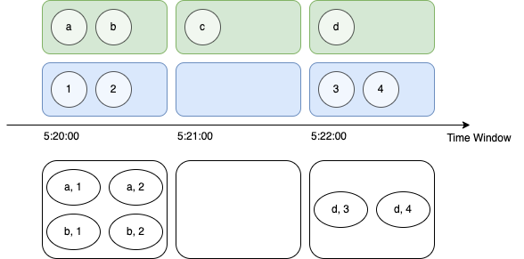
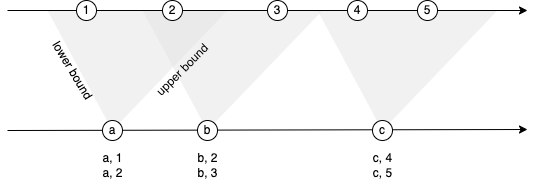
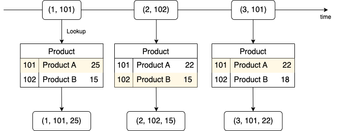

<head>
  <link rel="canonical" href="https://docs.risingwave.com/docs/current/query-syntax-join-clause/" />
</head>


A JOIN clause, also known as a join, combines the results of two or more table expressions based on certain conditions, such as whether the values of some columns are equal.

For regular equality joins on streaming queries, the temporary join results are unbounded. If the size of the join results becomes too large, query performance may get impacted. Therefore, you may want to consider time-bounded join types such as interval joins and temporal joins.

## Regular joins

RisingWave supports these regular join types:

- Inner joins
- Left (outer) joins
- Right (outer) joins
- Full (outer) joins

### Inner joins

An inner Join returns the rows from both the left and the right table expressions where the specified join condition is met. Rows that do not meet the condition will be excluded from the result set.

The syntax of INNER JOIN is as follows:

```sql
<table_expression> INNER JOIN <table_expression> ON <join_conditions>;
<table_expression> INNER JOIN <table_expression> USING (<col_name>, <col_name>, ...);
<table_expression> NATURAL [ INNER ] JOIN <table_expression>;
```

### Left outer joins

A left outer join (or simply left join) returns all rows from the left table expression and the matched rows from the right table expression. If no match is found, NULL values will be filled in for columns from the right table.

The syntax of LEFT (OUTER) JOIN is as follows:

```sql
<table_expression> LEFT [ OUTER ] JOIN <table_expression> ON <join_conditions>;
<table_expression> LEFT [ OUTER ] JOIN <table_expression> USING (<col_name>, <col_name>, ...);
<table_expression> NATURAL LEFT [ OUTER ] JOIN <table_expression>;
```

### Right outer joins

A right outer join (or simply right join) returns all rows from the right table expression and the matched rows from the left table expression. If no match is found, NULL values will be returned for columns from the left table expression.

The syntax of RIGHT (OUTER) JOIN is as follows:

```sql
<table_expression> RIGHT [ OUTER ] JOIN <table_expression> ON <join_conditions>;
<table_expression> RIGHT [ OUTER ] JOIN <table_expression> USING (<col_name>, <col_name>, ...);
<table_expression> NATURAL RIGHT [ OUTER ] JOIN <table_expression>;
```

### Full outer joins

A full outer join (or simply, full join) returns all rows when there is a match in either the left or right table expression. If no match is found, NULL values will be returned for columns from the table expression where no match is found.

```sql
<table_expression> FULL [ OUTER ] JOIN <table_expression> ON <join_conditions>;
<table_expression> FULL [ OUTER ] JOIN <table_expression> USING (<col_name>, <col_name>, ...);
<table_expression> NATURAL FULL [ OUTER ] JOIN <table_expression>;
```

## Window joins

In a regular join (that is, a join without time attributes), the join state may grow without restriction. If you only need to get windowed results of two sources, you can segment data in the sources into time windows, and join matching windows from the two sources. To create a window join, the same [time window functions](../functions-operators/sql-function-time-window.md) must be used, and the window size must be the same.



The syntax of a window join is:

```sql
<time_window_expression> JOIN <time_window_expression> ON <join_conditions>;
```

One of the `join_conditions` must be an equality condition based on the watermarks of the two table expressions. For the syntax of `<time_window_expression>`, see [Time window functions](../functions-operators/sql-function-time-window.md).

For example, suppose you have these two sources:

```sql
CREATE SOURCE s1 (
 id int, 
 value int, 
 ts TIMESTAMP, 
 WATERMARK FOR ts AS ts - INTERVAL '20' SECOND
) WITH (connector = 'datagen');

CREATE SOURCE s2 (
 id int, 
 value int, 
 ts TIMESTAMP, 
 WATERMARK FOR ts AS ts - INTERVAL '20' SECOND
) WITH (connector = 'datagen');
```

You can join them with the following statement:

```sql
CREATE MATERIALIZED VIEW window_join AS
SELECT s1.id AS id1,
       s1.value AS value1,
       s2.id AS id2,
       s2.value AS value2
FROM TUMBLE(s1, ts, interval '1' MINUTE)
JOIN TUMBLE(s2, ts, interval '1' MINUTE)
ON s1.id = s2.id and s1.window_start = s2.window_start;
```

This query will join the two sources `s1` and `s2` based on the `id` column and the window start time. For the unclosed windows, the join result will be updated immediately when new data arrives.

### State cleaning

Usually, a join operator will maintain all the existing rows for both sides in the internal state table. However, if a window join satisfies the following conditions:

- Both sides are defined with watermark.
- Both of the time window functions are defined on their watermark columns respectively.
- The join condition includes the equality condition on the watermark columns.

Then, RisingWave will automatically clean up the state for the expired windows. The example above satisfies these conditions, so the join state will be cleaned up automatically after the 1-minute watermark passes.

See [Watermarks](transform/watermarks.md) for more information on watermarks.

## Interval joins

Window joins require that the two sources have the same window type and window size. This requirement can be too strict in some scenarios. If you want to join two sources that have some time offset, you can create an interval join by specifying an accepted interval range based on watermarks.



The syntax of an interval join is:

```sql
<table_expression> JOIN <table_expression> ON <equality_join_condition> AND <interval_condition> ...;
```

In an interval join, the `interval_condition` is a range condition based on the timestamps of the two table expressions, such as `s1.ts BETWEEN s2.ts [- <time_interval>] AND s2.ts [+ <time_interval>]`.

For example, for sources `s1` and `s2` used in the above section, you can create an interval join:

```sql
CREATE MATERIALIZED VIEW interval_join AS
SELECT s1.id AS id1,
       s1.value AS value1,
       s2.id AS id2,
       s2.value AS value2
FROM s1 JOIN s2
ON s1.id = s2.id and s1.ts between s2.ts and s2.ts + INTERVAL '1 minute';
```

This query will join the two sources `s1` and `s2` based on the `id` column and the time range. For the unclosed windows, the join result will be updated immediately when new data arrive.

### State Cleaning

Interval join‘s state cleaning is triggered only when upstream messages arrive, and it operates at the granularity of each join key. As a result, if no messages are received for a join key, the state may still hold stale data.

## Process-time temporal joins

A process-time temporal join is a join that uses the process time of the left-hand side (LHS) table to look up the right-hand side (RHS) table. The latest value at the moment of joining from the RHS table is used.



Different from regular joins, the changes in the RHS table are not reflected in the join result. The join result is only updated when the LHS table changes.

#### Syntax

```sql
SELECT ... FROM <table_expression> [AS <alias>]
[ LEFT | INNER ] JOIN <table_expression> FOR SYSTEM_TIME AS OF PROCTIME() [AS <alias>]
ON <join_conditions>;
```

#### Notes

- The left table expression is a table or source.
- The right table expression is a table, index or materialized view.
- The process-time syntax `FOR SYSTEM_TIME AS OF PROCTIME()` is included in the right table expression.
- The join type is INNER JOIN or LEFT JOIN.
- The Join condition includes the primary key or index key of the right table expression. Please create an index on the right table expression if necessary.

#### Example

If you have a source that emits messages like below:

| transaction_id | product_id | quantity | sale_date  | process_time        |
|----------------|------------|----------|------------|---------------------|
| 1              | 101        | 3        | 2023-06-18 | 2023-06-18 10:15:00 |
| 2              | 102        | 2        | 2023-06-19 | 2023-06-19 15:30:00 |
| 3              | 101        | 1        | 2023-06-20 | 2023-06-20 11:45:00 |

Assuming the data of `products` is as follows at 2023-06-18 10:15:00 (process time of transaction 1) 

| id | product_name | price |
|----|--------------|-------|
| 101 | Product A    | 25    |
| 102 | Product B    | 15    |

At 2023-06-19 15:30:00 (process time of transaction 2):

| id | product_name | price |
|----|--------------|-------|
| 101 | Product A    | 22    |
| 102 | Product B    | 15    |

At 2023-06-20 11:45:00 (process time of transaction 3):

| id | product_name | price |
|----|--------------|-------|
| 101 | Product A    | 22    |
| 102 | Product B    | 18    |

For the same product ID, the product name or the price is updated from time to time.

You can use a temporal join to fetch the latest product name and price from the `products` table and form a wider table. To further improve performance, you can create an index for table `products`, and join `sales` with the index instead.

```sql
SELECT transaction_id, product_id, quantity, sale_date, product_name, price 
FROM sales
JOIN products FOR SYSTEM_TIME AS OF PROCTIME()
ON product_id = id;
```

| transaction_id | product_id | quantity | sale_date  | product_name | price |
|----------------|------------|----------|------------|--------------|-------|
| 1              | 101        | 3        | 2023-06-18 | Product A    | 25    |
| 2              | 102        | 2        | 2023-06-19 | Product B    | 15    |
| 3              | 101        | 1        | 2023-06-20 | Product A    | 22    |

Notice that the Product A's price is 25 at the time of transaction 1 and 22 at the time of transaction 3.

### Internal state

Depending on LHS, the process-time temporal join may or may not maintain the internal state. 

- If the LHS is append-only i.e. a source, the join operator does not maintain the internal state.
- If the LHS is non-append-only i.e. a table or materialized view, the join operator must maintain the internal state of previous lookup results. This is because the historical values of the RHS table are needed to emit a corresponding delete event when a row from the LHS is deleted.

You may inspect it with the `EXPLAIN` command. For example, the following query's LHS is a source, so the join operator does not keep the internal state, as indicated by `append_only: true`.

```sql
EXPLAIN CREATE MATERIALIZED VIEW mv1 AS
select id1, a1, id2, a2 from stream, version FOR SYSTEM_TIME AS OF PROCTIME() where id1 = id2 AND a2 < 10;
```

```
StreamMaterialize { ... }
└─StreamExchange { ... }
  └─StreamTemporalJoin { type: Inner, append_only: true, predicate: stream.id1 = version.id2 AND (version.a2 < 10:Int32), output: [stream.id1, stream.a1, version.id2, version.a2, stream._row_id] }
    ├─StreamExchange { ... }
    │ └─StreamTableScan { table: stream, ... }
    └─StreamExchange { ... }
      └─StreamTableScan { table: version, ... }
```

