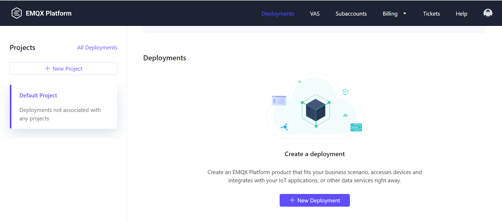

<head>
  <link rel="canonical" href="https://docs.risingwave.com/docs/current/ingest-from-emqx-broker/" />
</head>


You can ingest data from **EMQX**, a high-performance MQTT platform designed for seamless data collection, transmission, transformation, storage, and analysis between physical devices and digital systems. EMQ, a global leader in edge-cloud connectivity and data platforms, helps businesses tackle data challenges in sectors such as connected vehicles, smart factories, retail, drones, and distributed energy networks, including renewable energy grids and water systems.

## Set Up the EMQX broker

This guide will walk you through creating an EMQX broker on **EMQX Cloud** and connecting it to **RisingWave** for data ingestion. For detailed information, please refer to the [EMQX Documentation](https://docs.emqx.com/en/).

### 1. Sign up for an EMQX platform account

Start by signing up for an [EMQX Cloud](https://accounts.emqx.com/signup?continue=https%3A%2F%2Fwww.emqx.com%2Fcn%2Fcloud) account. The platform offers a 14-day free trial to explore its services.


*Sign up for EMQX Cloud.*

### 2. Create a new deployment

Once logged in to your EMQX Cloud account, go to the dashboard and click **New Deployment** to create a new EMQX broker.



*Create a new deployment.*

Select the **Serverless** plan to get a free EMQX broker, leave all other settings at their default values, and click **Deploy**.


*Deploy a serverless EMQX broker.*

Once deployed, your serverless EMQX broker is ready to use.


*Serverless EMQX Cloud deployment.*

### 3. Configure authentication and authorization

To secure your broker, configure authentication and authorization. Go to the **Access Control** -> **Authentication** page and add a **username** and **password** for your clients.


*Add username and password for authentication.*

Next, assign permissions for the username, enabling **publish** and **subscribe** actions for your MQTT topics.


*Set authorization details.*

Your broker is now ready to receive data from devices on the shop floor. Below is an example of the data structure for an electric motor:

```json
{
  "machine_id": "machine_1",
  "winding_temperature": 80,
  "ambient_temperature": 40,
  "vibration_level": 1.97,
  "current_draw": 14.43,
  "voltage_level": 50.37,
  "nominal_speed": 4207.69,
  "power_consumption": 646.32,
  "efficiency": 82.88,
  "ts": "2024-09-09 09:57:51"
}
```

## Ingest data from EMQX to RisingWave

### 1. Create a RisingWave cluster

Set up a RisingWave cluster on [RisingWave Cloud](https://cloud.risingwave.com/) using the free plan. Detailed setup instructions are available in the [RisingWave Cloud Documentation](https://docs.risingwave.com/cloud/manage-clusters/).

### 2. Create a source in RisingWave

Once your RisingWave cluster is running, create a source to ingest data from the EMQX broker. Use the following SQL query in the RisingWave Workspace:

```sql
CREATE TABLE shop_floor_machine_data (
    machine_id VARCHAR,
    winding_temperature INT,
    ambient_temperature INT,
    vibration_level FLOAT,
    current_draw FLOAT,
    voltage_level FLOAT,
    nominal_speed FLOAT, 
    power_consumption FLOAT,
    efficiency FLOAT,
    ts TIMESTAMP
)
WITH (
    connector='mqtt',
    url='ssl://xxxxxxxxx.us-east-1.emqxsl.com:8883',
    topic= 'factory/machine_data',
    username='xxxxxx',
    password='xxxxxx',
    qos = 'at_least_once'
) FORMAT PLAIN ENCODE JSON;
```

This query creates a source table that connects to the EMQX MQTT broker to retrieve data in JSON format.

### 3. Query the source

Once the source is created, you can run queries to retrieve the ingested data. For example:

```sql
SELECT * FROM shop_floor_machine_data LIMIT 5;
```

Here’s an example of the output:


*Query result from the source table.*

In this guide, you successfully:

1. Set up a free-trial EMQX Cloud broker.

2. Connected to the broker using the Python Paho Client to send data to a topic.

3. Ingested shop-floor data from EMQX into RisingWave for real-time analytics.

RisingWave enables real-time analytics, monitoring, predictive maintenance, and anomaly detection on data from the EMQX broker. Additionally, you can use RisingWave's MQTT Sink connector to forward the analysis results to the MQTT broker or other downstream systems, such as **Grafana**, for visualization and further insights.