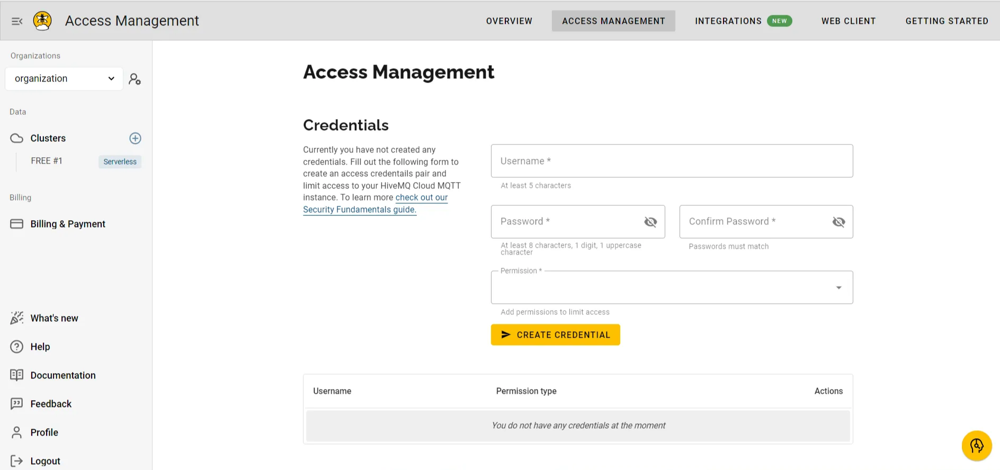

<head>
  <link rel="canonical" href="https://docs.risingwave.com/docs/current/ingest-from-hivemq-broker/" />
</head>

You can ingest data from HiveMQ, a leading MQTT platform renowned for its reliability, scalability, and flexibility. HiveMQ extends the MQTT standard to provide a comprehensive IoT messaging solution, trusted by brands like Air France-KLM, BMW, Mercedes-Benz, and ZF. It is widely adopted across industries such as automotive, energy, logistics, and smart manufacturing. The core of HiveMQ is its high-performance, MQTT-compliant broker, ensuring fast and reliable data transmission.

## Set Up a HiveMQ broker

This section provides step-by-step instructions for creating a HiveMQ broker on HiveMQ Cloud and connecting it to RisingWave for real-time data ingestion and analytics. This setup is ideal for IoT messaging and processing workflows. For additional details, refer to the official [HiveMQ Documentation](https://docs.hivemq.com/hivemq/latest/user-guide/index.html#:~:text=HiveMQ%20is%20a%20world-class,%20enterprise-ready%20MQTT%20platform%20that%20provides%20fast,).

### 1. Sign Up for HiveMQ Cloud

To begin, sign up for a free trial of HiveMQ Cloud at [HiveMQ Cloud](http://console.hivemq.cloud/). This service offers cloud-based, enterprise-grade MQTT capabilities tailored for IoT messaging.


*HiveMQ Cloud Sign-Up page.*

### 2. Create a HiveMQ cluster

After signing in, follow these steps to create a new HiveMQ cluster:

1. Select **Create New Cluster**.
2. Choose between **Serverless** and **Starter** cluster options. Select **Serverless** for a fast, easy setup.


*HiveMQ Cloud Cluster Creation.*

Once your **Serverless** HiveMQ cluster is set up, you can publish and subscribe to IoT events within minutes.


*HiveMQ Cloud Free Plans: Serverless and Starter.*

### 3. Configure cluster access

To securely connect and interact with the HiveMQ broker, you'll need to set up user credentials:

- Add a **username** and **password**.
- Assign the necessary permissions to **publish** and **subscribe** to the MQTT topics.



*HiveMQ Cluster Access Management.*

These credentials allow your MQTT clients to publish and subscribe securely to the HiveMQ broker.

### 4. Cluster details

You'll now have access to your cluster details, which include: **Cluster name**, **Current plan**, **Cloud provider**, **Cluster URL and port**, and **WebSocket URL and port**.

These details are essential for connecting to the HiveMQ broker using MQTT clients.


*HiveMQ Serverless Cluster Details.*

With your HiveMQ Cloud cluster ready, you can now start sending data from IoT devices to the MQTT broker. This example demonstrates how to send IoT data (e.g., device health metrics) using the Python Paho client. Each data point includes temperature, humidity, and status readings from a specific device at a particular timestamp.

For detailed setup, refer to the [HiveMQ Quick Start Guide](https://docs.hivemq.com/hivemq-cloud/quick-start-guide.html).

## Set Up a RisingWave cluster

To ingest data into RisingWave, you'll need to create a RisingWave cluster. Sign up for a free plan at [RisingWave Cloud](https://cloud.risingwave.com/) to explore its features. You can refer to the [RisingWave Documentation](https://docs.risingwave.com/docs/current/intro/) for comprehensive, step-by-step instructions. For further assistance or to join the community, connect with us on [Slack](https://www.risingwave.com/slack).


*RisingWave Cloud Sign-Up page.*

### 1. Create a data source in RisingWave

Use the following SQL query to create a table called `iot_sensor_data` in RisingWave. This table will store incoming data from your HiveMQ broker:

```sql
CREATE TABLE iot_sensor_data (
  device_id VARCHAR,
  ts TIMESTAMP,
  temperature INTEGER,
  humidity VARCHAR,
  device_status INTEGER
)
WITH (
  connector = 'mqtt', 
  url = 'ssl://xxxxxxxxx.s1.eu.hivemq.cloud:8883',
  topic = 'iot_topic',
  username = 'xxxxxx',
  password = 'xxxxxx',
  qos = 'at_least_once',
  scan.startup.mode = 'earliest'
) FORMAT PLAIN ENCODE JSON;
```

In this setup:
- **device_id** represents the IoT device identifier.
- **ts** is the timestamp.
- **temperature** and **humidity** represent sensor readings.
- **device_status** indicates whether the device is in a normal or abnormal state.

This query connects RisingWave to the HiveMQ broker, retrieving real-time data from the earliest available MQTT records.

### 2. Query the data source

You can query the `iot_sensor_data` table to view the latest records using the following SQL query:

```sql
SELECT * FROM iot_sensor_data LIMIT 5;
```

This query retrieves the top five records, providing a snapshot of the latest IoT data, including device IDs, timestamps, temperature, humidity, and status values.


*Query results for IoT sensor data.*

You have successfully set up a HiveMQ serverless cluster and connected it to RisingWave for real-time data ingestion and analysis. Using the RisingWave MQTT connector, you can monitor, analyze, and even perform predictive maintenance on your IoT data.

Additionally, you can use the RisingWave MQTT Sink connector to send processed results back to HiveMQ. These results can be visualized using tools like Grafana, enabling you to derive deeper insights from your IoT data.