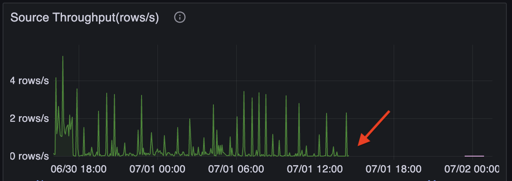
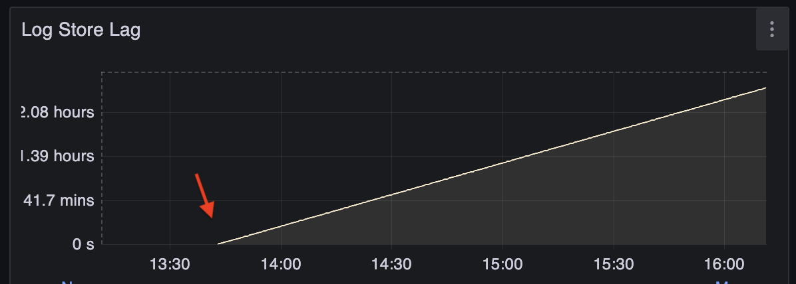

Generally, the performance of streaming jobs can be significantly affected by the sources and sinks.

- **Sources**: If the upstream system fails or is under heavy load, the source may not be able to provide data promptly, causing zero or slow data ingestion and high end-to-end latency.
- **Sinks**: If the downstream system fails or is under heavy load, RisingWave may not be able to write data to the sink promptly, causing high backpressure and increasing latency.

This guide aims to help you identify problems caused by sources and sinks. To troubleshoot these issues, you usually need to check the upstream or downstream systems and fix the root causes.

## Symptoms

To identify a source problem, navigate to **Grafana dashboard (dev)** > **Streaming** section > **Source Throughput** panel. If the ingestion rate is zero or significantly lower than expected, the source may be the bottleneck.

*Example of a stuck source:*

A sink problem is usually more serious because it back-pressures the entire streaming job, causing high barrier latency. To mitigate this issue, RisingWave introduced **sink decoupling** (i.e. buffering) before writing to the sink since v1.10. However, if the problem lasts for a long time, the buffer may eventually become full, causing the entire streaming job to be blocked.

To identify a sink problem, navigate to **Grafana dashboard (dev)** > **Sink Metrics** section > **Log Store Lag** panel. This panel shows how much data is waiting to be written out. If the lag is increasing, the sink may be the bottleneck.

*Example of a stuck sink:*

:::info

We are currently rolling out sink decoupling to all sinks. Track the latest progress [here](https://github.com/risingwavelabs/risingwave/issues/17095).

:::

## Diagnosis

It is helpful to check the logs of both RisingWave and the source or sink system, especially when the source or sink is failing instead of being slow.

Source and sink connectors are running on RisingWave Compute nodes, and sometimes require validation in the Meta node. Search for "`risingwave_connector_node`" in the RisingWave logs to find related information.

The root causes of source and sink problems are various. You may need to check their documents or logs to address the root causes.

Here are some common issues:

- The source or sink system is down, overloaded, or misconfigured, causing RisingWave to fail to connect to it.
- The network is poor between RisingWave and the source and sink systems. Ensure they are deployed in the same data center or region.
- Long-running transactions in the upstream databases prevent CDC sources from reading new changes. PostgresQL's vacuum may also cause this problem.
- Rate limit of downstream system leads to frequent write failures.
- Lock contention or deadlock in the downstream database causes long lock-wait time.
